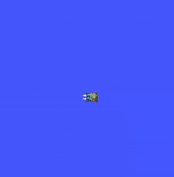
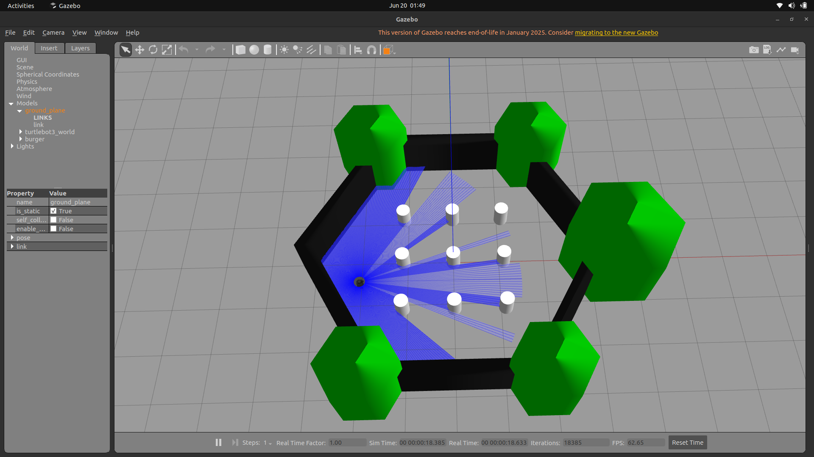
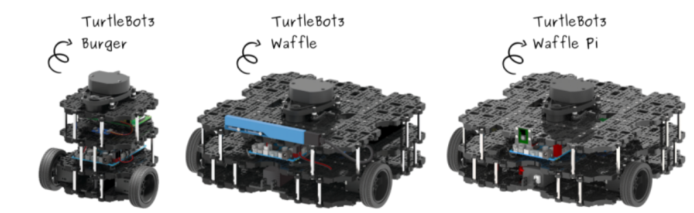
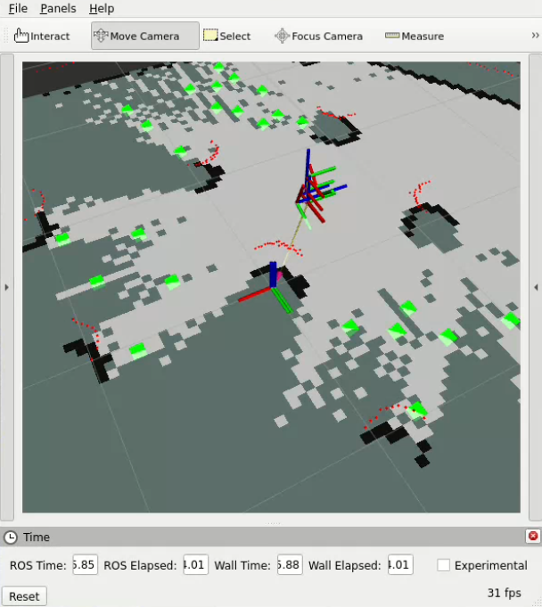

# Frontier Exploration Robot

## Aim

To create an autonomous frontier exploring robot capable of navigating through obstacles and creating an accurate 2D map of an unexplored environment.

## Prerequisites

* Ubuntu **22.04.5**
* ROS 2 **Humble**
* Gazebo and RViz2
* Nav2 and SLAM Toolbox

## Working

1. **Frontier Cell Clustering**: Frontier cells are detected and clustered into frontier edges using BFS Algorithm.
2. **Centroid Selection**: Centroids are calculated for each frontier edge and the centroid corresponding to the largest frontier is chosen as the goal.
3. **Path Generation and Autonomous Navigation**: Chosen goal is fed to Nav2 stack and an ideal path is generated and followed by the robot.
4. **Map Visualization**: Real-time map is generated on RViz2 as the bot moves and explores the environment.

## Turtlesim Package

Turtlesim is a beginner-friendly ROS 2 package used to learn the fundamentals of publishing, subscribing, topics, services, and actions. It provides a simple 2D turtle simulator where you can send velocity commands, draw shapes, control the turtle's pose, or interact through custom nodes.

We used the Turtlesim package in our project to learn the fundamentals of ROS2 and how different publisher and subscriber nodes communicate with each other, how to operate the turtle using teleop commands and how to analyse the `rqt_graph`. We also learned how to create various custom nodes that communicate with the turtlesim node, some of which have been shown below:



**Spiral Trajectory**


**N-Sided Polygon**


**Go To Goal**

## Gazebo Classic

Gazebo Classic is a powerful 3D robotics simulator used to test and develop robot algorithms without needing real hardware.

#### ROS 2 integration via `gazebo_ros_pkgs` enables:

* controlling simulated robots with ROS 2 nodes.
* publishing sensor data as ROS topics.
* sending velocity commands.
* running SLAM, navigation, and custom algorithms.

We used Gazebo Classic to simulate TurtleBot3 `waffle` model in the simulated world. We used teleoperation to run the bot in the gazebo simulated world and created various custom nodes that correctly publish and subscribe to topics that control the robot inside Gazebo.



### TurtleBot3

TurtleBot3 is a modular, lightweight, and fully open-source mobile robot designed for learning and research in ROS 2. It comes with built-in packages for simulation, navigation, SLAM, and teleoperation. In Gazebo Classic, you can easily spawn different official models - `burger`, `waffle`, and `waffle_pi` - each with its own size, sensors, and capabilities.

We used TurtleBot3 for testing algorithms like mapping, localization, frontier exploration, and path planning before deploying to real hardware.



**TurtleBot3 Models - `Burger`, `Waffle`, and `Waffle Pi`**

## SLAM in ROS 2

In ROS 2, SLAM (Simultaneous Localisation and Mapping) is used to build a map of an unknown environment while estimating the robot's position within it. ROS 2 primarily uses two modern SLAM systems: **SLAM Toolbox**, the official and most widely supported 2D laser-based SLAM solution, and **Cartographer**, Google's graph-based LiDAR mapping system.

In our project, we used SLAM Toolbox during simulation because Gazebo provides clean, noise-free sensor data and almost perfect odometry, making SLAM Toolbox lightweight, stable, and ideal for quick testing of mapping and frontier extraction. However, on the real robot we switched to Google Cartographer, as it handles real-world challenges like sensor noise, drift, wheel slip, and timing jitter far more robustly. Cartographer produced smoother, more reliable maps on hardware, which directly improved the stability of frontier detection, centroid selection, and navigation during actual exploration.

## RViz2 Visualization Software

**RViz2** is the primary 3D visualization tool for ROS 2, used to observe and debug everything happening in a robot system. It makes it easy to understand how the robot perceives its environment and helps verify that SLAM and navigation are working correctly.

We used RViz2 as our main visualization tool to test and debug the exploration algorithms. The LIDAR scans, map, and robot pose were visualized live to verify SLAM performance. We also published markers to display detected frontiers, their centroids, the selected goal, and the computed Dijkstra path, which helped us confirm that frontier extraction and path planning were working correctly. RViz essentially acted as a real-time dashboard, allowing us to observe how the robot perceived the environment and how our algorithms responded.



## Nav2 Stack

Nav2 (Navigation2) is the ROS 2 system that lets a robot move to a goal on its own. It uses the map from SLAM, figures out where the robot is, plans a safe path, avoids obstacles, and sends smooth velocity commands to the robot. Nav2 works with TurtleBot3 in both Gazebo simulation and real hardware, making it essential for tasks like autonomous navigation, waypoint following, and exploring indoor environments.

We used Nav2 navigation stack to make our robot move to its goal on its own. Nav2 was responsible for handling tasks like path generation, planning, obstacle avoidance and controlling the robot's movements autonomously in real-time when it was given the goal coordinates by our Node.


## The Final Result


* **Map Building:** As the robot moves, SLAM continuously updates an occupancy grid showing free space, obstacles, and unknown area.
* **Frontier Detection:** We scanned the map to find frontiers - boundary cells between free space and unknown space.
* **Clustering and Centroids:** Frontiers are grouped into clusters, and centroid of each cluster is computed to represent a meaningful explorable target.
* **Goal Selection:** From all centroids, farthest centroid is chosen as the optimal goal.
* **Navigation with Nav2:** The chosen centroid is sent to Nav2, which plans a safe path and drives the robot to the centroid autonomously.
* **Execution and Replanning:** The robot navigates to the goal, updates the map, and the cycle repeats as new frontiers appear.

## Installations

### Installing Gazebo Classic

1. Install Gazebo (Gazebo Classic packages for ROS2)
```
sudo apt install -y ros-humble-gazebo-*
```

2. Create a workspace for TurtleBot3 packages
```
mkdir -p ~/turtlebot3_ws/src
cd ~/turtlebot3_ws/src
```

3. Clone the official TurtleBot3 repos
```
git clone https://github.com/ROBOTIS-GIT/turtlebot3.git
git clone https://github.com/ROBOTIS-GIT/turtlebot3_msgs.git
git clone https://github.com/ROBOTIS-GIT/turtlebot3_simulations.git
```

4. Build the workspace with colcon build and source the workspace
```
cd ~/turtlebot3_ws
colcon build --symlink-install
source ~/turtlebot3_ws/install/setup.bash
```
### Running a Gazebo Simulation with TurtleBot3:

1. Export your desired TurtleBot3 model. We will be using model `burger`
```
export TURTLEBOT3_MODEL=burger
```

2. Launch your desired world.
```
# empty world
ros2 launch turtlebot3_gazebo empty_world.launch.py

# full TurtleBot3 world
ros2 launch turtlebot3_gazebo turtlebot3_world.launch.py
```

3. Operate your robot using teleoperation commands
```
ros2 run teleop_twist_keyboard teleop_twist_keyboard
```

### Installing SLAM Toolbox, RViz2, and Nav2 Stack:

1. Install SLAM Toolbox.
```
sudo apt install -y ros-humble-slam-toolbox

```

2. Install RViz2.
```
sudo apt install -y ros-humble-rviz2

```

3. Install Nav2 Stack.
```
sudo apt install -y ros-humble-navigation2 ros-humble-nav2-bringup

```

## References

* ROS 2 Humble Documentation: https://docs.ros.org/en/humble/Installation.html
* TurtleBot3 Official e-Manual: https://emanual.robotis.com/docs/en/platform/turtlebot3/simulation/

### Image Credits

* TurtleBot3 image courtesy of ROBOTIS: https://www.turtlebot.com/turtlebot3/
