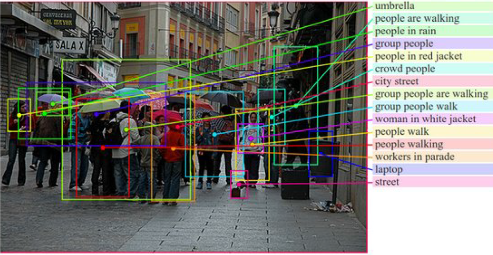
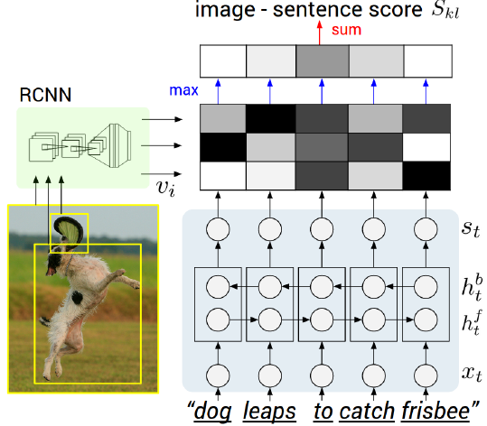
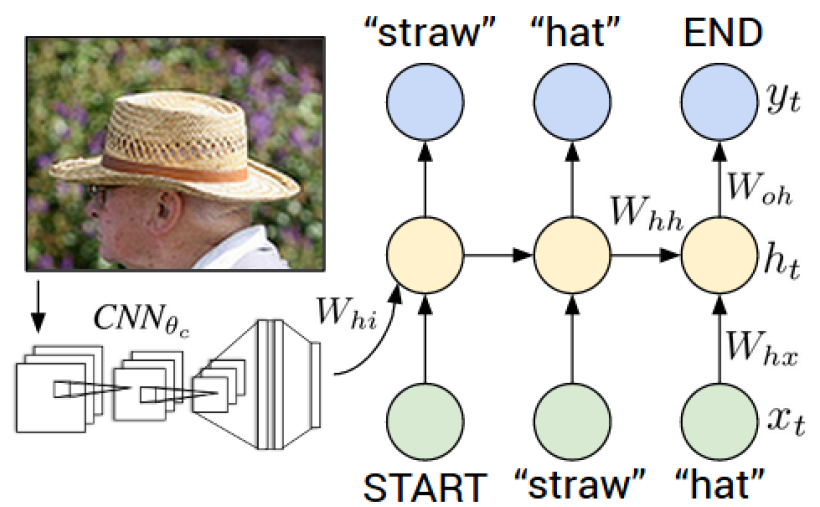
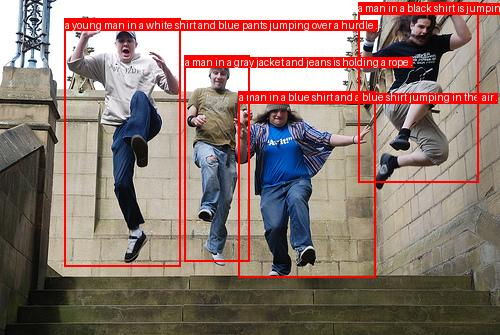

# Region Captioning using Multimodal Deep Learning

## Overview

This project implements a **Region Captioning System** that bridges the gap between Computer Vision and Natural Language Processing using Deep Learning.

Unlike traditional image captioning models that describe an entire image with a single sentence, **Region Captioning** focuses on generating fine-grained, natural language descriptions for specific regions within an image, offering a more localized and contextual understanding.

---

## Table of Contents

- [Objective](#objective)
- [Approach](#approach)
- [Dataset and preprocessing](#dataset-and-preprocessing)
- [Architecture overview](#architecture-overview)
- [Alignment model](#alignment-model)
- [Generative model](#generative-model)
- [Results](#results)
- [Applications](#applications)
- [Learning outcomes](#learning-outcomes)
- [References](#references)

---

<a id="objective"></a>
## Objective

The goal of this project is to design and implement a deep learning-based **Region Captioning System** capable of automatically describing multiple regions within an image.

Unlike global captioning that summarizes the entire image, this system generates **localized captions** that describe individual objects or regions — such as *"a man wearing a helmet"* or *"a dog running on the road."*

### Example:



---

<a id="approach"></a>
## Approach

The project follows a progressive learning and implementation pipeline:

1. **Theoretical Learning:** Studied Neural Networks, CNNs, RNNs, and multimodal architectures.

2. **Region Proposal:** Used **Faster R-CNN** for detecting regions of interest (bounding boxes).

3. **Feature Extraction (Visual Encoder):** Implemented a **VGG-19-based CNN** to extract region-level features from each detected bounding box.

4. **Text Encoding (Language Encoder):** Built an **RNN/GRU-based model** to convert textual captions into numerical embeddings.

5. **Multimodal Embedding Space:** Mapped both image and text features into a shared vector space where similar image–text pairs lie close together.

6. **Alignment Training:** Used a **max-margin ranking loss** to align image regions with corresponding caption fragments.

7. **Generative Extension:** Leveraged the learned embeddings to train a caption generator that produces region-wise captions for unseen images.

---

<a id="dataset-and-preprocessing"></a>
## Dataset and Preprocessing

### Dataset

- **Source:** Flickr30k Entities (an extension of Flickr8k/30k)
- The Flickr30k dataset contains about 31,000 real-world images, each paired with 5 human-written English captions describing the scene.

### Preprocessing Pipeline

#### 1. Parsing
- Extracted image paths, captions, and bounding box coordinates from annotations.

#### 2. Image Preprocessing
- Resized and padded images for uniform input size.
- Applied random cropping, rotation, and color jitter for data augmentation.
- Converted images to tensors normalized to the range [-1, 1].

#### 3. Caption Preprocessing
- Tokenized sentences using `nltk`.
- Constructed a vocabulary with `<pad>`, `<start>`, `<end>`, `<unk>` tokens.
- Created word–index mappings and saved as `vocab.pkl`.

#### 4. Data Loader
- Returned paired (image, caption) tensors.
- Implemented `collate_fn` to handle variable-length captions dynamically during batching.

---

<a id="architecture-overview"></a>
## Architecture Overview

The model has two main stages:

| Stage | Component | Function |
|-------|-----------|----------|
| 1️⃣ | **Alignment Model** | Learns correspondence between image regions and textual fragments |
| 2️⃣ | **Generative Model** | Generates captions for unseen image regions using learned embeddings |

### Combined Multimodal Pipeline:
```
Image → CNN Encoder → Visual Embedding
Caption → RNN/GRU Encoder → Text Embedding
Both → Shared Embedding Space → Caption Generation
```

---

<a id="alignment-model"></a>
## Alignment Model

### Components




#### Encoder (AlignmentEncoderCNN)
- Based on **VGG-19**, pre-trained on ImageNet.
- Extracts deep region-level feature maps.
- Uses **Adaptive Average Pooling (7×7)** for uniform feature size.
- Passes pooled features through an FC layer → embedding vector.
- **L2 normalization** ensures fair similarity comparison with text vectors.

#### Decoder (AlignmentDecoderRNN)
- Uses **Embedding + GRU + Linear layer**.
- Encodes caption sequences into text embeddings.
- The final GRU hidden state represents the sentence meaning.
- Also **L2-normalized** for cosine similarity computation.

### Intuitive Explanation

The alignment model learns a shared space where visually similar regions and semantically similar text lie close together. If a caption describes a region (e.g., "a brown dog"), their embeddings align closely in this space.

### Mathematical Formulation

**Image–Sentence Matching Score:**

$$S_{kl} = \sum_{t \in g_l} \max_{i \in g_k} (v_i^T s_t)$$

Where:
- $v_i$: Image region vector
- $s_t$: Word or phrase vector
- $S_{kl}$: Similarity between image k and sentence l

**Loss Function (Max-Margin Ranking Loss):**

$$C(\theta) = \sum_k \left[ \sum_l \max(0, S_{kl} - S_{kk} + 1) + \sum_l \max(0, S_{lk} - S_{kk} + 1) \right]$$

This ensures that correct image–caption pairs have higher similarity scores than mismatched ones.

---

<a id="generative-model"></a>
## Generative Model




After the alignment model is trained, its learned embeddings are used to generate captions for image regions.

- **Encoder:** CNN (VGG-19 or ResNet-50) extracts region features.
- **Decoder:** GRU/LSTM generates captions word-by-word using context and region embedding.
- **Training:** Uses teacher forcing with cross-entropy loss over predicted words.

---


<a id="results"></a>
## Results



- This is the link to our trained models → [**Models**](https://drive.google.com/drive/folders/1H4nR-iftoYyXA3hfUFHXRoFOhuikjqiw?usp=sharing)

---

<a id="applications"></a>
## Applications

| Domain | Application |
|--------|-------------|
| Autonomous Systems | Scene understanding for perception & navigation |
| Medical Imaging | Describing localized anatomical regions |
| Surveillance | Detecting and describing activities in CCTV frames |
| Image Retrieval | Text-based search for image regions |
| Assistive Tech | Scene narration for visually impaired users |

---

<a id="learning-outcomes"></a>
## Learning Outcomes

- Gained hands-on experience in CNNs, RNNs, GRUs, and multimodal learning.
- Learned PyTorch for end-to-end model implementation.
- Understood joint embedding learning and ranking-based training.
- Practiced data parsing, augmentation, and preprocessing techniques.
- Developed understanding of region-level captioning beyond global image-level tasks.

---

<a id="references"></a>
## References

1. Karpathy & Fei-Fei — *"[Deep Visual-Semantic Alignments for Generating Image Descriptions](https://arxiv.org/pdf/1412.2306)"*, CVPR 2015.
2. PyTorch Official Documentation — [https://pytorch.org](https://pytorch.org)

---


## 👥 Collaborators


<a href="https://github.com/amanKarki-AK">
  
  <strong> Aman Karki </strong>
</a>
<br />
<a href="https://github.com/Ritikavarshney-hub">
  
  <strong> Ritika Varshney</strong>
</a>
<br />
<a href="https://github.com/nidhi-059">
  
  <strong> Nidhi Soni </strong>
</a>
